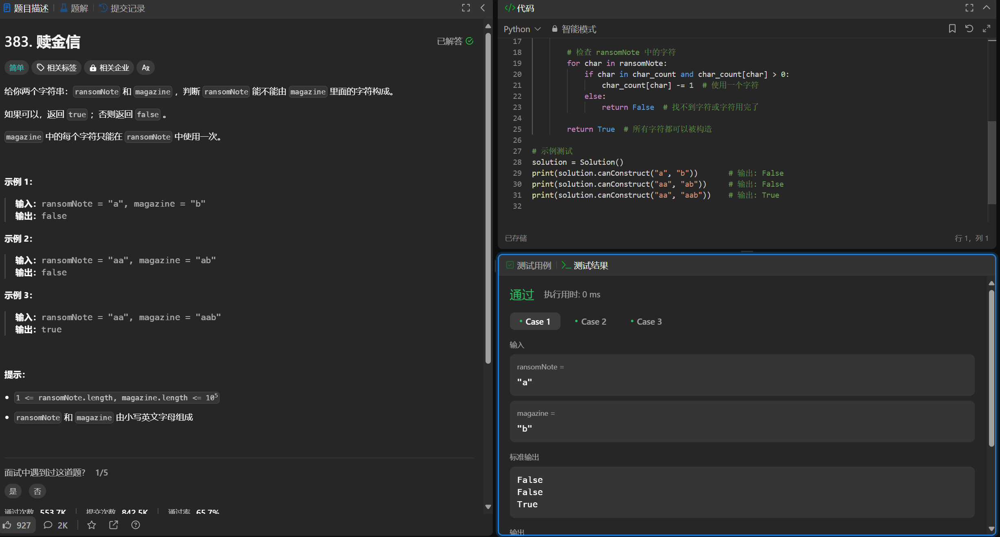
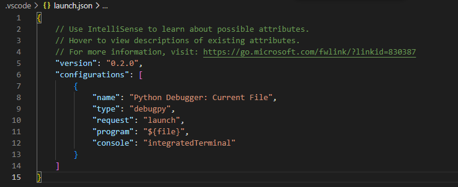
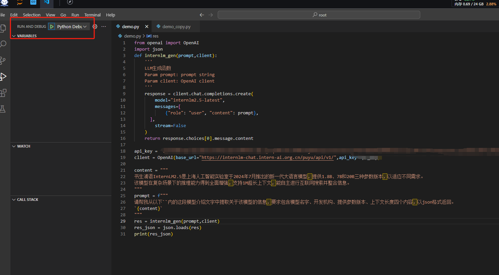
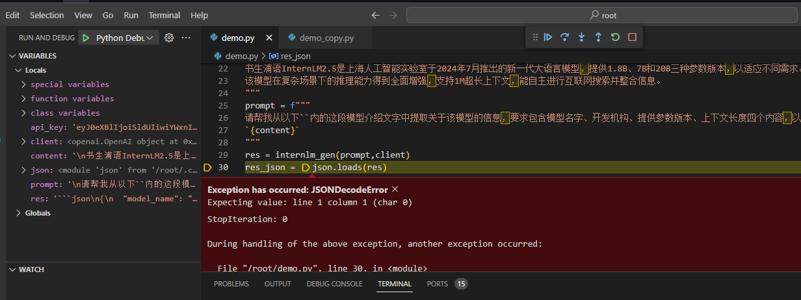
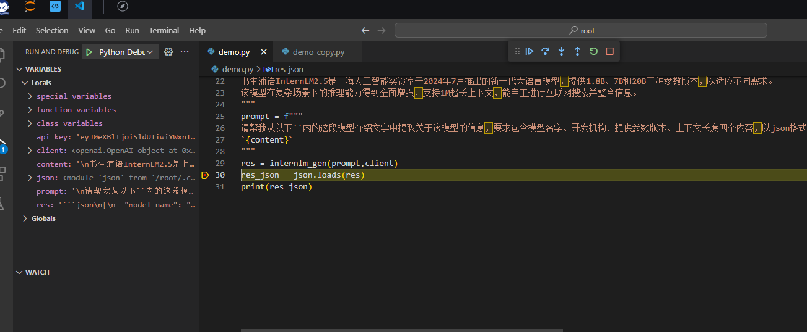
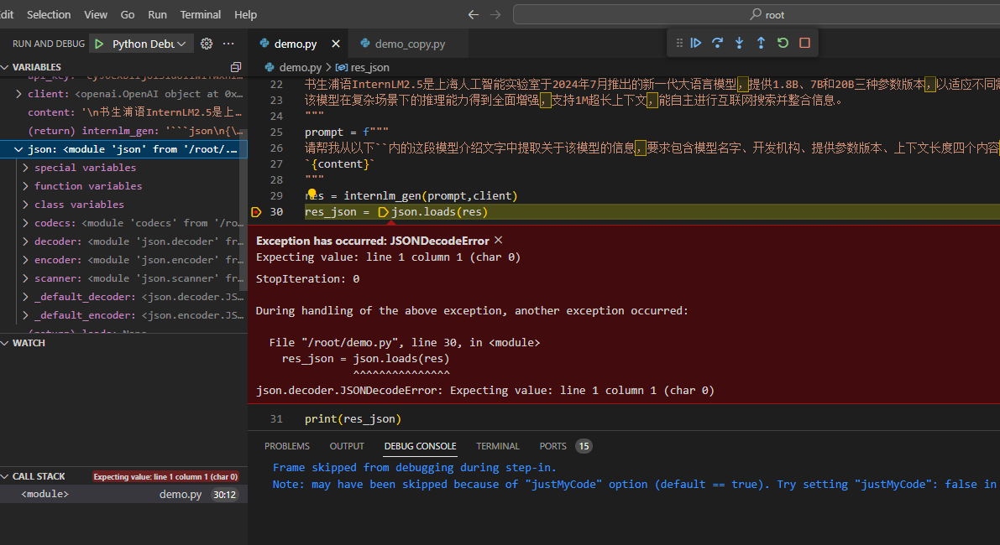
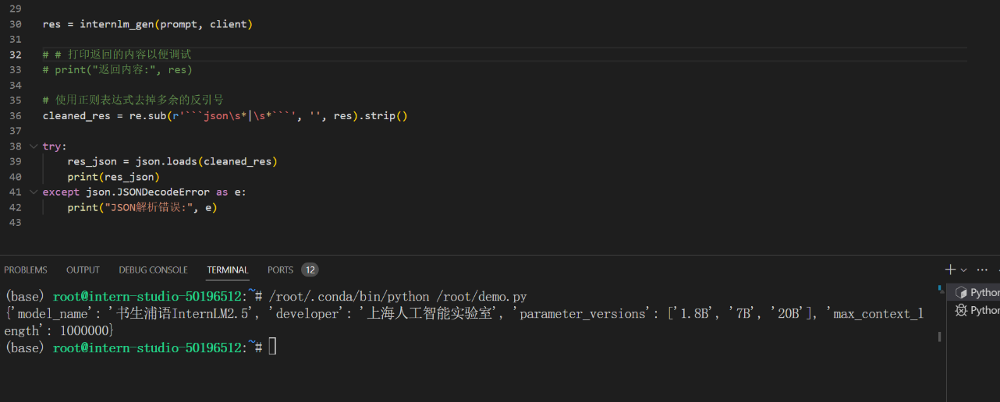

# L0G2000 
## Task1 Leetcode
Leetcode 383 运行python代码如图：


---


## Task2 调用书生浦语API实现将非结构化文本转化成结构化json

配置debug调试文件：


- 在vscode中使用debug运行


运行后报错：


报错为：
```
JSON decode error: Expecting value: line 1 column 1 (char 0)

```

我们在此处添加断点，启动debug



- 查看变量
当代码在断点处停下来时，你可以查看和修改变量的值。在“Run and Debug”侧边栏的“Variables”（变量）部分，可以看到当前作用域内的所有变量及其值。


发现是json字符串没有被正确转义，在此处的原因可以发现是prompt中使用的特殊字符符号没有加双引号" "包裹。

修改之后运行：




## 书生·浦语大模型实战营
项目地址：https://github.com/InternLM/Tutorial/