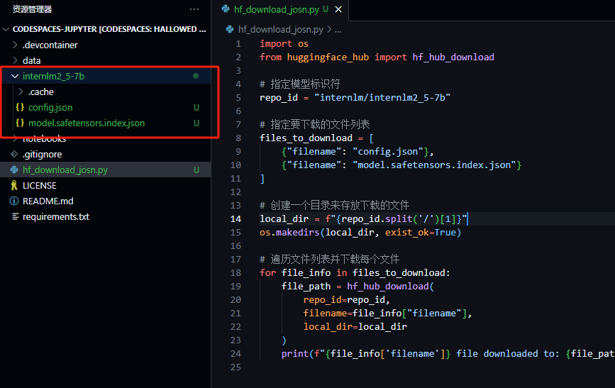

## 模型下载：
使用Hugging Face平台，以internlm2_5-1_8b举例


在Github CodeSpace线上代码平台界面下方的终端（terminal）安装以下依赖，便于模型运行。
```
# 安装transformers
pip install transformers==4.38
pip install sentencepiece==0.1.99
pip install einops==0.8.0
pip install protobuf==5.27.2
pip install accelerate==0.33.0

```
运行 hf_download_josn.py后可以看到模型成功下载到文件夹


下载internlm2_5-chat-1_8b并打印示例输出
运行hf_download_1_8_demo.py文件后输出：


在HF平台上使用Spaces并把intern_cobuild部署成功:


## 书生·浦语大模型实战营
项目地址：https://github.com/InternLM/Tutorial/